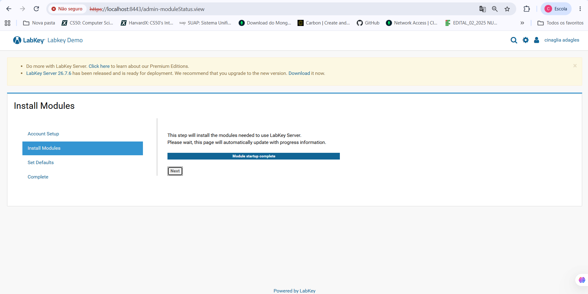
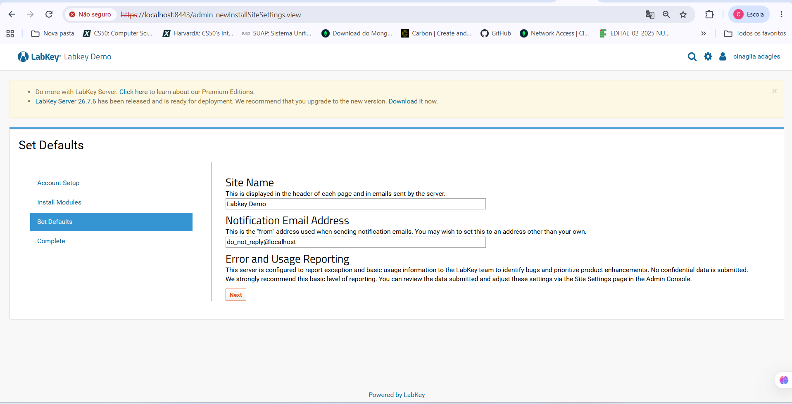
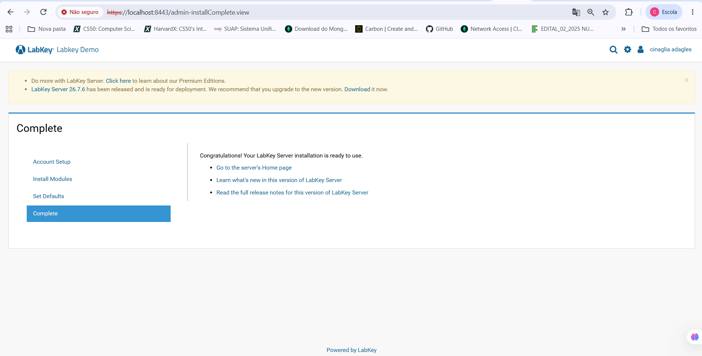
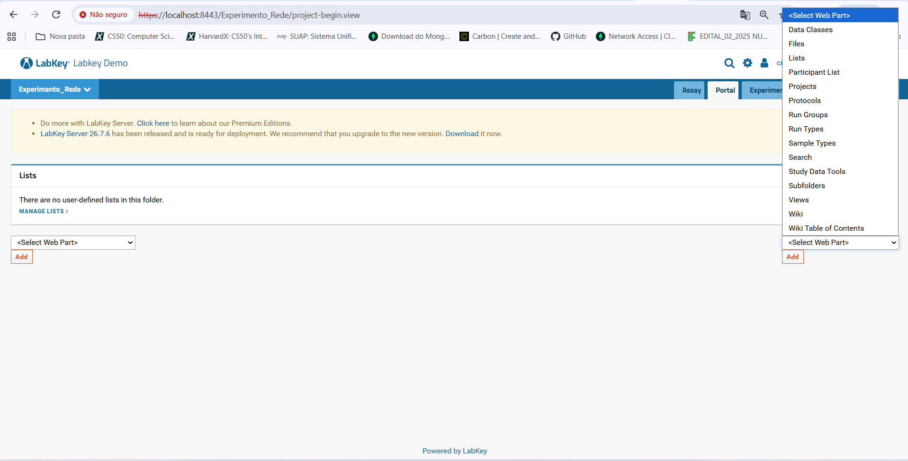
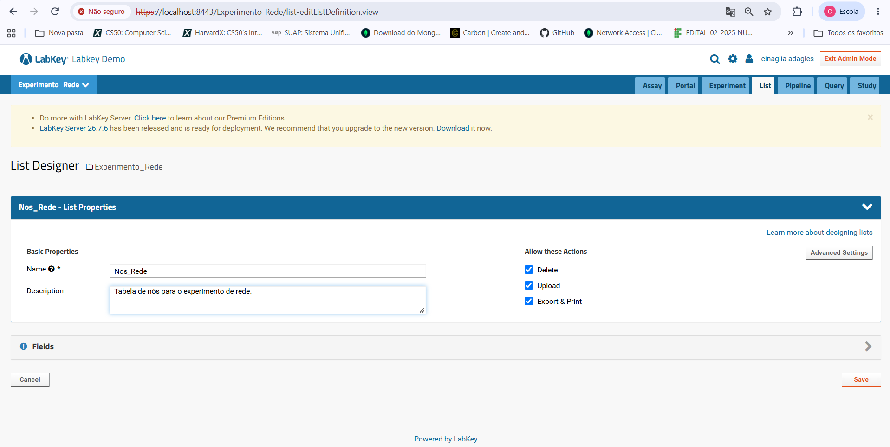
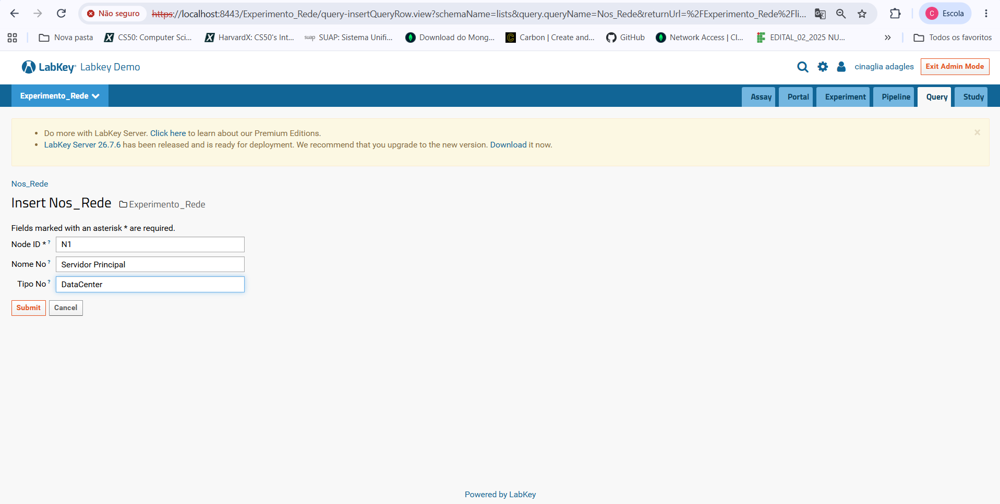
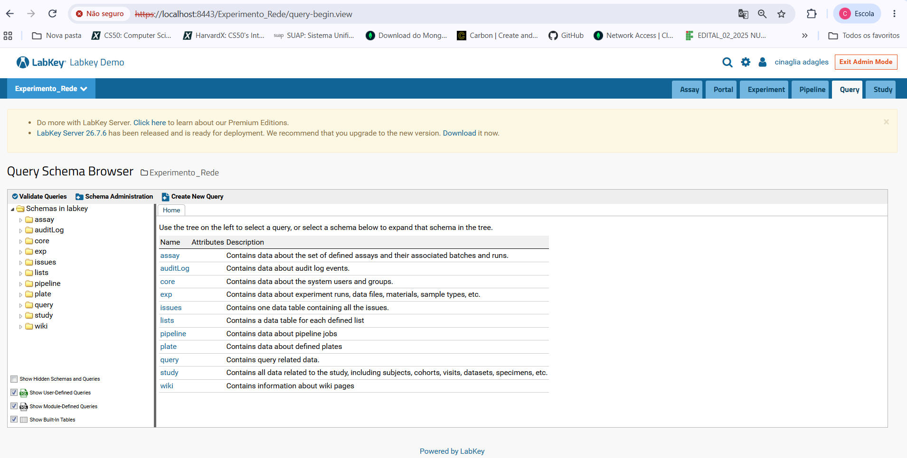
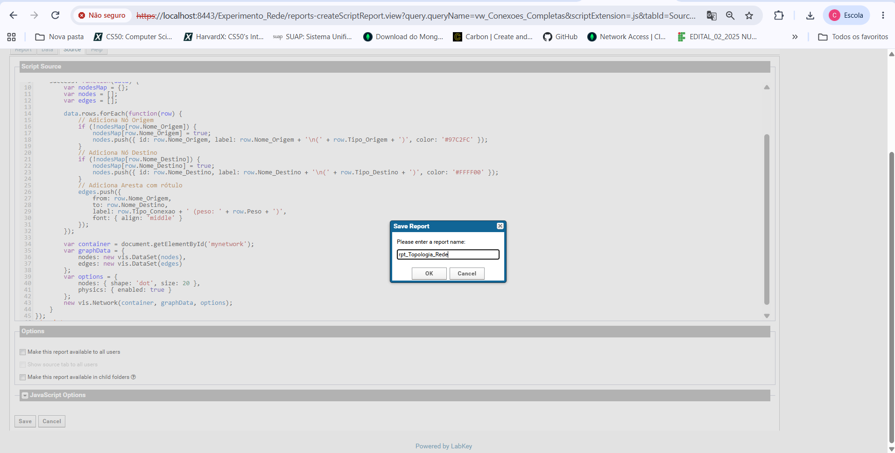

# Validação da Interface e Arquitetura do LabKey Server (TCC)

Este repositório reúne as comprovações visuais da instalação, configuração, criação de projeto, modelagem relacional de topologia de rede, inserção de dados e geração de relatórios interativos utilizando a plataforma **LabKey Server**.

---

## 1. Instalação e Configuração da Plataforma

Etapas do assistente de instalação inicial do servidor LabKey Server em ambiente local.

### 1.1 Configuração do Administrador Inicial
Criação do usuário principal do sistema com permissões de administrador.

### 1.2 Instalação dos Módulos do Sistema
Processo automatizado de inicialização e carga dos módulos nativos do servidor.

### 1.3 Definições Padrão da Aplicação (*Set Defaults*)
Configuração dos parâmetros gerais do site, como nome da aplicação e e-mail de notificações.

### 1.4 Instalação Concluída
Confirmação da implantação do ambiente do servidor pronto para uso.

---

## 2. Estruturação do Projeto e Gestão de Espaços de Trabalho

Organização do espaço de trabalho e definição de permissões de acesso para o experimento de topologia.

### 2.1 Criação do Projeto (`Experimento_Rede`)
Definição do nome do projeto, tipo de pasta e seleção dos módulos ativos.

### 2.2 Configuração de Permissões de Acesso
Definição da política inicial de segurança e permissões do projeto (*My User Only*).

### 2.3 Definições de Armazenamento do Projeto (*Project Settings*)
Configuração da localização padrão para os ficheiros e recursos do projeto.

### 2.4 Interface Inicial em Modo de Administração
Visão da área de trabalho do projeto com o modo de administração ativado (*Page Admin Mode*).

### 2.5 Personalização da Interface (*Web Parts*)
Menu de seleção e adição de componentes de interface (*Web Parts*) ao painel do portal.

---

## 3. Modelagem Relacional e Gestão de Dados

Definição das listas relacionais, estrutura dos campos e inserção dos componentes da rede.

### 3.1 Repositório de Listas do Experimento
Painel de gestão de listas ativas na pasta `Experimento_Rede`.

### 3.2 Designer de Listas (`Nos_Rede`)
Definição dos campos da tabela `Nos_Rede` e atribuição do `Node_ID` como chave primária (*Key Field*).

### 3.3 Inserção de Dados na Tabela (`Insert Nos_Rede`)
Formulário de registo de novos elementos na rede (ex.: Nó `N1`, Nome `Servidor Principal`, Tipo `DataCenter`).

---

## 4. Consultas e Esquemas SQL (`Query Schema Browser`)

Exploração da estrutura de dados e criação de consultas personalizadas.

### 4.1 Navegador de Esquemas (*Query Schema Browser*)
Painel de navegação pelos esquemas de base de dados do sistema (ex.: `lists`, `query`, `core`).

### 4.2 Código-Fonte da View SQL
Consulta relacional (*LEFT JOIN*) criada para unificar a tabela de arestas e os nós correspondentes.

### 4.3 Execução e Exportação da Consulta
Visualização da consulta relacional com suporte para exportação em Excel, CSV e TSV.

---

## 5. Visualização Interativa da Topologia

Desenvolvimento do relatório vetorial dinâmico utilizando JavaScript e HTML5 integrados à API da plataforma.

### 5.1 Script de Renderização
Código JavaScript utilizando `LABKEY.Query.selectRows` para obter os dados e construir o grafo.

### 5.2 Publicação do Relatório (`rpt_Topologia_Rede`)
Gravando e publicando o relatório no repositório oficial do LabKey.

### 5.3 Grafo Vetorial de Topologia de Rede
Resultado visual final interativo do mapeamento dos dispositivos e das suas respetivas conexões.

